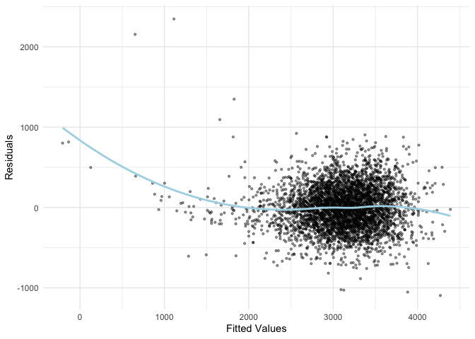
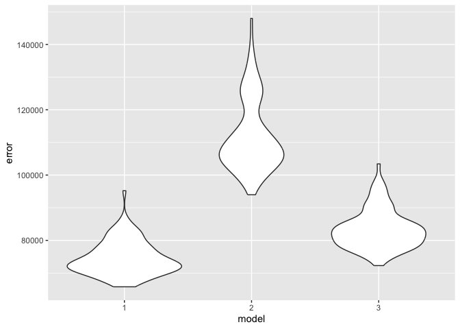

Homework 6
================

``` r
knitr::opts_chunk$set(echo = TRUE)
library(tidyverse)
library(modelr)
library(p8105.datasets)
set.seed(1)
```

## Q1

``` r
weather_df = 
  rnoaa::meteo_pull_monitors(
    c("USW00094728"),
    var = c("PRCP", "TMIN", "TMAX"), 
    date_min = "2017-01-01",
    date_max = "2017-12-31") %>%
  mutate(
    name = recode(id, USW00094728 = "CentralPark_NY"),
    tmin = tmin / 10,
    tmax = tmax / 10) %>%
  select(name, id, everything())
```

    ## using cached file: /Users/siiii/Library/Caches/org.R-project.R/R/rnoaa/noaa_ghcnd/USW00094728.dly

    ## date created (size, mb): 2024-09-26 10:19:26.958092 (8.651)

    ## file min/max dates: 1869-01-01 / 2024-09-30

``` r
log_sample = function(data) {
  log_data = data |>
    slice_sample(n = nrow(data), replace = TRUE)
    fit = lm(tmax ~ tmin, data = log_data)
    r_squared = broom::glance(fit)[["r.squared"]]
  
    coefficients = broom::tidy(fit)
    log_beta = log(coefficients[["estimate"]][1] * coefficients[["estimate"]][2])
  
    return(tibble(r_squared = r_squared, log_beta = log_beta))
}
```

``` r
n_log = 5000

log_results = tibble(iteration = 1:n_log) |>
  mutate(
    result = map(iteration, ~ log_sample(weather_df))
  ) |>
  unnest(result)
```

``` r
ggplot(log_results, aes(x = log_beta)) +
  geom_density() +
  labs(title = "Distribution of log(β0 * β1) from Bootstrap Samples",
       x = "log(β0 * β1)",
       y = "Density")
```

<!-- -->
description: it seems like it follows a normal distribution.

``` r
ci_r_sq = quantile(log_results[["r_squared"]], c(0.025, 0.975))
ci_log_beta = quantile(log_results[["log_beta"]], c(0.025, 0.975))
```

``` r
ci_df = tibble(
    metric = c("R-squared", "log(β0 * β1)"),
    estimate = c(mean(log_results[["r_squared"]]), mean(log_results[["log_beta"]])),
    conf.low = c(ci_r_sq[1], ci_log_beta[1]),
    conf.high = c(ci_r_sq[2], ci_log_beta[2])
  )
```

``` r
ci_plot = 
  ggplot(ci_df, aes(x = metric, y = estimate)) +
    geom_point(size = 3) +
    geom_errorbar(aes(ymin = conf.low, ymax = conf.high), width = 0.2) +
    labs(
      title = "95% Confidence Intervals",
      x = "Metric",
      y = "Estimate"
    ) +
    theme_minimal()
ci_plot
```

<!-- -->

## Q2

``` r
homicide_df = read.csv("homicide-data.csv")|>
  janitor::clean_names()
```

### creating a city_state variable

``` r
homicide_clean = 
  homicide_df |>
  filter(
    !is.na(victim_age),
    victim_race %in% c("White", "Black"))|>
  mutate(victim_age = as.numeric(victim_age))|>
  mutate(
    city_state = paste(city, state, sep = ", "),
    solved_status = ifelse(disposition %in% c("Closed by arrest", "Closed without arrest"), 1, 0))|>
  filter(
    !city_state %in% c("Dallas, TX", "Phoenix, AZ", "Kansas City, MO", "Tulsa, AL", "Tulsa, AL"))|>
  drop_na()
```

    ## Warning: There was 1 warning in `mutate()`.
    ## ℹ In argument: `victim_age = as.numeric(victim_age)`.
    ## Caused by warning:
    ## ! NAs introduced by coercion

### filtering Baltimore

``` r
md_df = 
  homicide_clean |>
  filter(city_state == "Baltimore, MD")
```

### making logistic regression

``` r
glm_fit =
  glm(
    solved_status ~ victim_age + victim_sex + victim_race, 
    data = md_df, 
    family = binomial
)
```

``` r
glm_summary = broom::tidy(glm_fit, conf.int = TRUE, exponentiate = TRUE)
```

``` r
odds_sex =
  glm_summary |> 
  filter(term == "victim_sexMale") |> 
  select(term, estimate, conf.low, conf.high)

odds_sex
```

    ## # A tibble: 1 × 4
    ##   term           estimate conf.low conf.high
    ##   <chr>             <dbl>    <dbl>     <dbl>
    ## 1 victim_sexMale    0.355    0.267     0.468

``` r
city_df = 
  homicide_clean |>
  group_by(city_state) |>
  nest()|>
  mutate(
    glm_fit = map(data, ~ glm(solved_status ~ victim_age + victim_sex + victim_race,
                              data = .x, family = binomial)),
    
    tidy_results = map(glm_fit, ~ broom::tidy(.x, conf.int = TRUE, exponentiate = TRUE)))|>
  
  unnest(tidy_results) |>
 
  filter(term == "victim_sexMale") |>
  
  select(city_state, or= estimate, conf.low, conf.high)
```

    ## Warning: There were 43 warnings in `mutate()`.
    ## The first warning was:
    ## ℹ In argument: `tidy_results = map(glm_fit, ~broom::tidy(.x, conf.int = TRUE,
    ##   exponentiate = TRUE))`.
    ## ℹ In group 1: `city_state = "Albuquerque, NM"`.
    ## Caused by warning:
    ## ! glm.fit: fitted probabilities numerically 0 or 1 occurred
    ## ℹ Run `dplyr::last_dplyr_warnings()` to see the 42 remaining warnings.

``` r
city_or_df =
  city_df |>
  arrange(desc(or)) |>
  mutate(city_state = factor(city_state, levels = city_state))

city_or_df
```

    ## # A tibble: 47 × 4
    ## # Groups:   city_state [47]
    ##    city_state           or conf.low conf.high
    ##    <fct>             <dbl>    <dbl>     <dbl>
    ##  1 Minneapolis, MN   1.08     0.533     2.14 
    ##  2 Stockton, CA      1.05     0.480     2.33 
    ##  3 Fresno, CA        1.01     0.392     2.43 
    ##  4 Oklahoma City, OK 0.909    0.578     1.42 
    ##  5 Birmingham, AL    0.707    0.446     1.10 
    ##  6 Tulsa, OK         0.703    0.392     1.21 
    ##  7 Boston, MA        0.672    0.352     1.27 
    ##  8 Los Angeles, CA   0.662    0.457     0.954
    ##  9 Nashville, TN     0.658    0.401     1.05 
    ## 10 San Francisco, CA 0.608    0.312     1.16 
    ## # ℹ 37 more rows

### OR plot

``` r
or_plot = 
  ggplot(city_or_df,aes(x = reorder(city_state, or), y = or)) +
  geom_point() + 
  geom_errorbar(aes(ymin = conf.low, ymax = conf.high), width = 0.2) + 
  labs(
    x = "City",
    y = "OR"
  ) +
  theme_minimal()+
  theme(axis.text.x = element_text(angle = 45, hjust = 1))

or_plot
```

<!-- -->
Comment: New York, NY has the lowest OR for solving homicides comparing
male victims to female victims keeping all other variables fixed, and
Minneapolis, MN has the highest OR for solving homicides comparing male
victims to female victims keeping all other variables fixed. Fresno, CA
has large CI.

## Q3

### importing the dataset and converting

``` r
bwt_df = read_csv("birthweight.csv")|>
  janitor::clean_names()|>
  mutate(
    babysex = 
      case_match(babysex, 
                 1 ~ "male",
                 2 ~ "female"),
    babysex = fct_infreq(babysex),
    
    frace = case_match(frace,
                1 ~ "white",
                2 ~ "black",
                3 ~ "asian",
                4 ~ "puerto rican",
                5 ~ "other"),
    frace = fct_infreq(frace),
    
    mrace = case_match(mrace,
                1 ~ "white",
                2 ~ "black",
                3 ~ "asian",
                4 ~ "puerto rican",
                5 ~ "other"),
    mrace = fct_infreq(mrace),
    
    malform = case_match(malform,
                 0 ~ "absent",
                 1 ~ "present"),
    malform = fct_infreq(malform)
    )|>
  drop_na()
```

    ## Rows: 4342 Columns: 20
    ## ── Column specification ────────────────────────────────────────────────────────
    ## Delimiter: ","
    ## dbl (20): babysex, bhead, blength, bwt, delwt, fincome, frace, gaweeks, malf...
    ## 
    ## ℹ Use `spec()` to retrieve the full column specification for this data.
    ## ℹ Specify the column types or set `show_col_types = FALSE` to quiet this message.

``` r
bwt_model =
  lm(bwt ~ babysex + bhead + blength + delwt + fincome + frace + gaweeks + malform + momage + mheight + ppbmi + smoken + wtgain + mrace, data = bwt_df)
```

I choose bwt as dependent variable. I choose babysex, bhead, blength as
infants’ characteristics, delwt, frace, momage, mheight, ppbmi, wtgain,
mrace, gaweeks, as parental characteristics, fincome, malform, smoken as
social factors. I use multiple linear regression because bwt is a
continous variable with more than two independent variables.

``` r
bwt_model_df =
  bwt_df |>
  add_predictions(bwt_model, var = "fitted") |>
  add_residuals(bwt_model, var = "residuals")
```

``` r
residuals_plot =
  ggplot(bwt_model_df, aes(x = fitted, y = residuals)) +
  geom_point(alpha = 0.4, size = 0.8) +
  geom_smooth(method = "loess", color = "lightblue", se = FALSE) +
  labs(
    x = "Fitted Values",
    y = "Residuals"
  ) +
  theme_minimal()

residuals_plot
```

    ## `geom_smooth()` using formula = 'y ~ x'

<!-- -->

``` r
cv_df =
  crossv_mc(bwt_df, 100)
```

``` r
model_full = function(train){
    lm(bwt ~ babysex + bhead + blength + delwt + fincome + frace + gaweeks + malform + momage + mheight + ppbmi + smoken + wtgain + mrace, data = train)
}

model_main = function(train){
  lm(bwt ~ blength + gaweeks, data = train)
}

model_interaction = function(train){
  lm(bwt ~ bhead * blength * babysex, data = train)
}
```

``` r
cv_results =
  cv_df |>
  mutate(
    model_1 = map(train, ~ model_full(as.data.frame(.x))),
    model_2 = map(train, ~ model_main(as.data.frame(.x))),
    model_3 = map(train, ~ model_interaction(as.data.frame(.x))))|>
  mutate(
    error_1 = map2_dbl(model_1, test, ~ mean((predict(.x, as.data.frame(.y)) - as.data.frame(.y)[["bwt"]])^2)),
    error_2 = map2_dbl(model_2, test, ~ mean((predict(.x, as.data.frame(.y)) - as.data.frame(.y)[["bwt"]])^2)),
    error_3 = map2_dbl(model_3, test, ~ mean((predict(.x, as.data.frame(.y)) - as.data.frame(.y)[["bwt"]])^2))
  )
```

``` r
cv_results |>
  select(starts_with("error"))|>
  pivot_longer(
    everything(),
    names_to = "model",
    values_to = "error",
    names_prefix = "error_")|>
  mutate(model = fct_inorder(model))|>
  ggplot(aes(x = model, y = error))+
  geom_violin()
```

<!-- -->
The full model has the lowest mean error. This suggests it performs well
in terms of prediction accuracy and is more consistent compared to the
other models. The main model has the highest mean error. This suggests
it performs the poorest in terms of prediction accuracy/ The interaction
model also performs well in terms of prediction accuracy and is more
consistent compared to the other models.
