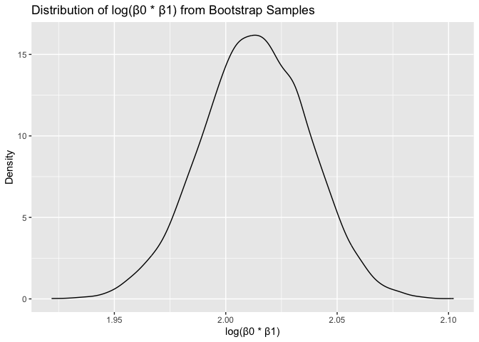
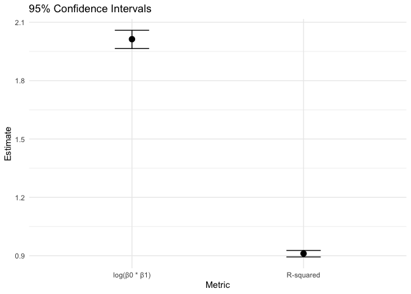
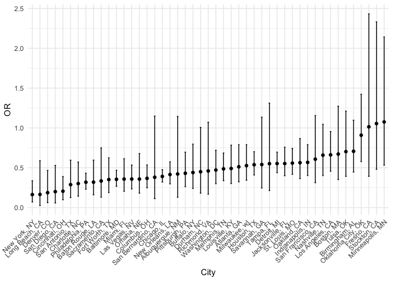

Homework 1 Solution
================

``` r
knitr::opts_chunk$set(echo = TRUE)
library(tidyverse)
set.seed(1)
```

## Q1

``` r
weather_df = 
  rnoaa::meteo_pull_monitors(
    c("USW00094728"),
    var = c("PRCP", "TMIN", "TMAX"), 
    date_min = "2017-01-01",
    date_max = "2017-12-31") %>%
  mutate(
    name = recode(id, USW00094728 = "CentralPark_NY"),
    tmin = tmin / 10,
    tmax = tmax / 10) %>%
  select(name, id, everything())
```

    ## using cached file: /Users/siiii/Library/Caches/org.R-project.R/R/rnoaa/noaa_ghcnd/USW00094728.dly

    ## date created (size, mb): 2024-09-26 10:19:26.958092 (8.651)

    ## file min/max dates: 1869-01-01 / 2024-09-30

``` r
log_sample = function(data) {
  log_data = data |>
    slice_sample(n = nrow(data), replace = TRUE)
    fit = lm(tmax ~ tmin, data = log_data)
    r_squared = broom::glance(fit)[["r.squared"]]
  
    coefficients = broom::tidy(fit)
    log_beta = log(coefficients[["estimate"]][1] * coefficients[["estimate"]][2])
  
    return(tibble(r_squared = r_squared, log_beta = log_beta))
}
```

``` r
n_log = 5000

log_results = tibble(iteration = 1:n_log) |>
  mutate(
    result = map(iteration, ~ log_sample(weather_df))
  ) |>
  unnest(result)
```

``` r
ggplot(log_results, aes(x = log_beta)) +
  geom_density() +
  labs(title = "Distribution of log(β0 * β1) from Bootstrap Samples",
       x = "log(β0 * β1)",
       y = "Density")
```

<!-- -->
description: it seems like it follows a normal distribution.

``` r
ci_r_sq = quantile(log_results[["r_squared"]], c(0.025, 0.975))
ci_log_beta = quantile(log_results[["log_beta"]], c(0.025, 0.975))
```

``` r
ci_df = tibble(
    metric = c("R-squared", "log(β0 * β1)"),
    estimate = c(mean(log_results[["r_squared"]]), mean(log_results[["log_beta"]])),
    conf.low = c(ci_r_sq[1], ci_log_beta[1]),
    conf.high = c(ci_r_sq[2], ci_log_beta[2])
  )
```

``` r
ci_plot = 
  ggplot(ci_df, aes(x = metric, y = estimate)) +
    geom_point(size = 3) +
    geom_errorbar(aes(ymin = conf.low, ymax = conf.high), width = 0.2) +
    labs(
      title = "95% Confidence Intervals",
      x = "Metric",
      y = "Estimate"
    ) +
    theme_minimal()
ci_plot
```

<!-- -->

## Q2

``` r
homicide_df = read.csv("homicide-data.csv")|>
  janitor::clean_names()
```

``` r
homicide_clean = 
  homicide_df |>
  filter(
    !is.na(victim_age),
    victim_race %in% c("White", "Black"))|>
  mutate(victim_age = as.numeric(victim_age))|>
  mutate(
    city_state = paste(city, state, sep = ", "),
    solved_status = ifelse(disposition %in% c("Closed by arrest", "Closed without arrest"), 1, 0))|>
  filter(
    !city_state %in% c("Dallas, TX", "Phoenix, AZ", "Kansas City, MO", "Tulsa, AL", "Tulsa, AL"))|>
  drop_na()
```

    ## Warning: There was 1 warning in `mutate()`.
    ## ℹ In argument: `victim_age = as.numeric(victim_age)`.
    ## Caused by warning:
    ## ! NAs introduced by coercion

### filtering Baltimore

``` r
md_df = 
  homicide_clean |>
  filter(city_state == "Baltimore, MD")
```

``` r
glm_fit =
  glm(
    solved_status ~ victim_age + victim_sex + victim_race, 
    data = md_df, 
    family = binomial
)
```

``` r
glm_summary = broom::tidy(glm_fit, conf.int = TRUE, exponentiate = TRUE)
```

``` r
odds_sex =
  glm_summary |> 
  filter(term == "victim_sexMale") |> 
  select(term, estimate, conf.low, conf.high)

odds_sex
```

    ## # A tibble: 1 × 4
    ##   term           estimate conf.low conf.high
    ##   <chr>             <dbl>    <dbl>     <dbl>
    ## 1 victim_sexMale    0.355    0.267     0.468

``` r
city_df = 
  homicide_clean |>
  group_by(city_state) |>
  nest()|>
  mutate(
    glm_fit = map(data, ~ glm(solved_status ~ victim_age + victim_sex + victim_race,
                              data = .x, family = binomial)),
    
    tidy_results = map(glm_fit, ~ broom::tidy(.x, conf.int = TRUE, exponentiate = TRUE)))|>
  
  unnest(tidy_results) |>
 
  filter(term == "victim_sexMale") |>
  
  select(city_state, estimate, conf.low, conf.high)
```

    ## Warning: There were 43 warnings in `mutate()`.
    ## The first warning was:
    ## ℹ In argument: `tidy_results = map(glm_fit, ~broom::tidy(.x, conf.int = TRUE,
    ##   exponentiate = TRUE))`.
    ## ℹ In group 1: `city_state = "Albuquerque, NM"`.
    ## Caused by warning:
    ## ! glm.fit: fitted probabilities numerically 0 or 1 occurred
    ## ℹ Run `dplyr::last_dplyr_warnings()` to see the 42 remaining warnings.

``` r
city_or_df =
  city_df |>
  arrange(desc(estimate)) |>
  mutate(city_state = factor(city_state, levels = city_state))
```

### OR plot

``` r
or_plot =
  ggplot(city_or_df, aes(x = city_state, y = estimate)) +
  geom_point() + 
  geom_errorbar(aes(ymin = conf.low, ymax = conf.high), width = 0.2) + 
  labs(
    x = "City",
    y = "OR"
  ) +
  theme_minimal()+
  theme(axis.text.x = element_text(angle = 45, hjust = 1))  

or_plot
```

<!-- -->

## Q3
